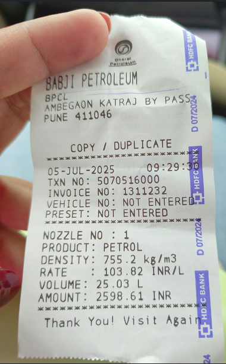
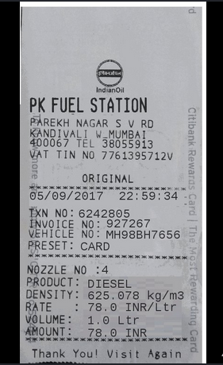

# 🧾 Receipt → CSV

Convert receipt photos into structured CSV files automatically — no manual data entry.

> Built for event management agencies, small businesses, and anyone tired of manually entering receipts into spreadsheets.


---

## The Problem

After every event, someone has to manually enter 100+ receipts into a spreadsheet. It takes hours. It's error-prone. It's the worst part of the job.

This tool eliminates that entirely.

---

## How It Works

```
Receipt photo (JPG/PNG)
        ↓
Image Preprocessing (OpenCV)
— Scale 2x for better OCR accuracy
— Convert to grayscale
— Deskew tilted receipts
        ↓
OCR Text Extraction (Tesseract)
        ↓
Rule-based Parsing
— Extracts structured fields from supported receipt layouts
— Extracts receipt metadata and transaction details
— Returns structured receipt data
        ↓
CSV Export
```

---

## Example Input and Output

### Fuel receipt
<p align="center">
  
  
</p>

### Output (Screenshot of CSV)


---

## Pipeline Stages

### 1. Preprocessing (`preprocess.py`)
Raw receipt photos are often low quality — crumpled, tilted, poor lighting. Before OCR runs, the image is:
- **Scaled 2x** using INTER_CUBIC interpolation — sharpens text edges for better OCR
- **Converted to grayscale** — OCR engines struggle with RGB
- **Deskewed** — corrects tilted receipts using angle detection

### 2. OCR Extraction (`ocr.py`)
Tesseract OCR extracts raw text from the preprocessed image.

### 3. Parsing (`parser.py`)
Raw OCR output is messy. The parser extracts structured receipt fields:

```python
{
    "date": "2025-07-05",
    "time": "09:29",
    "fuel_type": "PETROL",
    "volume": "25.03",
    "rate": "103.82",
    "amount": "2598.61",
    "receipt_no": "1311232"
}
```

### 4. CSV Export (`exporter.py`)
Structured recript data is written to a clean CSV file ready for Excel, Tally, or any accounting tool.

---

## Project Structure

```
receipt-to-csv/
│
├── main.py           # Entry point — connects all stages
├── preprocess.py     # Image preprocessing pipeline (OpenCV)
├── ocr.py            # Tesseract OCR extraction
├── parser.py         # Rule-based parser for supported receipt formats
├── exporter.py       # JSON → CSV export
│
├── samples/          # Test receipt images
├── outputs/          # Generated CSV files
│
├── .env              # API keys (never committed)
├── requirements.txt  # Dependencies
└── README.md
```

---

## Tech Stack

| Layer | Technology |
|---|---|
| Image Processing | OpenCV |
| OCR Engine | Tesseract (pytesseract) |
| Parsing | Python |
| Export | Python CSV module |
| Planned Frontend | Javascript |

---

## Setup

**1. Clone the repo**
```bash
git clone https://github.com/tejasmcodes/receipt-to-csv
cd receipt-to-csv
```

**2. Install dependencies**
```bash
pip install -r requirements.txt
```

**3. Install Tesseract**
```bash
# Ubuntu/Linux
sudo apt install tesseract-ocr

# macOS
brew install tesseract
```

**4. Run**
```bash
python main.py
```

---

## Roadmap

### V1 — Working Pipeline (In Progress)
- [x] Image preprocessing (scaling, grayscale, deskewing)
- [x] Tesseract OCR extraction
- [x] Parsing OCR text
- [x] CSV export

### V2 — Backend & Web Interface
- [ ] FastAPI backend
- [ ] Image upload API
- [ ] Web frontend
- [ ] CSV download from UI

### V3 — Generalization & Scaling
- [ ] Generalized receipt parsing
- [ ] Fallback parsing system
- [ ] Multi-format export (Excel/PDF)
- [ ] Batch receipt processing


---

## Target Users
- **Educational Institutions** — processing fuel receipts, vendor receipts after school/college events
- **Event management agencies** — processing vendor receipts after events
- **Small businesses** — GST filing and expense tracking
- **Freelancers** — client expense reporting
- **Accountants** — managing receipts for multiple clients

---

## Why I Built This

Event agencies, Educational institutions in India spend 4-6 hours after every event manually entering receipts. This tool reduces that to under 5 minutes.

Built by [Tejas M](https://github.com/tejasmcodes) — follow the build journey on [X (@tejasmcodes)](https://x.com/tejasmcodes)

---

## Current Limitations (V1)

The current parser is optimized primarily for fuel/transport receipts and known layouts.

Generalized receipt understanding, fallback parsing, and support for arbitrary invoice structures are planned for future versions.

---

## Challenges Faced

 - OCR inaccuracies on low-quality receipts
 - skew correction
 - varying receipt layouts
 - parsing noisy OCR output


## License

MIT
